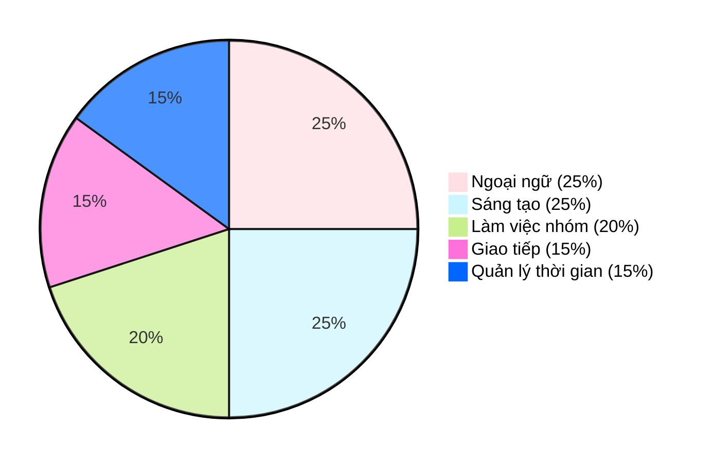

  

  

## Thông tin cá nhân

- Xin chào, mình là Bảo Châu (Joey)
- Mình là sinh viên chuyên ngành Thiết kế Đa phương tiện
- Theo học tại Học viện Công nghệ Bưu chính Viễn thông, Cơ sở quận 9, TP. Hồ Chí Minh  

## Contact me

-  [joeypeonyyy44@gmail.com](mailto:joeypeonyyy44@gmail.com)  
-  [Bảo Châu](https://www.facebook.com/bao.chau.997306/)  
-  [@joey.peony](https://www.instagram.com/joey.peony)  
-  [behance.net/joeybaochau](https://www.behance.net/chuchu97)  
 

## Trình độ học vấn

- Từng tham gia đội tuyển Học sinh giỏi Văn, trường THPT Nguyễn Du, Quận 10, TP.HCM
- Thủ khoa toàn khối cấp trường môn Lịch sử THPTQG 2023
- GPA học kỳ:  
  - 3 kỳ đạt trên 3.4/4.0 (Loại Giỏi)  
  - 1 kỳ đạt trên 3.25/4.0 (Loại Giỏi)  

## Kỹ năng

### Các kỹ năng mềm như

### 📚 Ngoài ra còn có kiến thức về:

#### Công cụ đồ họa và thiết kế
- Công cụ đồ họa: 
   
   
   
  

#### Kiến thức nền tảng chuyên ngành
- Kiến thức nền tảng:
  

## Dự án cá nhân (Personal Project)

## Dự án nhóm (Group Project)

   ### Đồ án kết thúc học phần Thiết kế hình động
  
   - Vai trò: Character Design
   
 Xem sản phẩm tại đây: [Thiết kế hình động/facebook.com](https://www.facebook.com/bao.chau.997306/videos/437898679390990)

   ### Đồ án kết thúc học phần Dựng audio và video phi tuyến tính
   - Say you do - Tiên Tiên (MV Remake)
   - Vai trò: Script writer, Director, Art Director, Camera crew, Stylist
   
  Xem sản phẩm tại đây: [facebook.com/sayyoudo-remake](https://www.facebook.com/bao.chau.997306/videos/726893959906067)

## ✨ Sở Thích & Quan Điểm

> Khám phá chiều sâu của Sáng tạo, Thẩm mỹ và Tư duy Chiến lược.

| Chủ đề | Hoạt động |
| :--- | :--- |
| **🎨 Sáng tạo & Thẩm mỹ** | Xem các dự án thiết kế chuyên sâu. Đến các triển lãm nghệ thuật & tham gia workshop thiết kế. |
| **🧠 Học hỏi & Tư duy** | Đọc phân tích về các case study Branding/Marketing. Nghiên cứu phát triển Bộ nhận diện thương hiệu. Nghe podcast/Youtube về giáo dục, tài chính, tư duy (VIETSUCCESS, Vietcetera). |
| **🧘 Giải trí & Cảm hứng** | Đọc thơ, viết lách, vẽ tranh, nghe nhạc (cổ điển/Jazz). Xem video đáng yêu về động vật. |

## 🚀 Trải Nghiệm Nổi Bật

| Lĩnh vực | Vai trò & Thành tựu |
| :--- | :--- |
| **🎬 Sản xuất Dự án** | **Sản xuất** dự án phim ngắn "TRẠM" (Contest PN14N 2024). |
| **🏆 Lãnh đạo & Giải thưởng** | Đạt giải Khuyến Khích nhóm cuộc thi **STEM** cấp THPT (Trị giá 1.500.000 VNĐ). Từng là Ban cán sự lớp THCS & THPT. |
| **🤝 Kỹ năng Teamwork** | **Điều phối, Quản lý & Phê duyệt Nội dung** trong các dự án học thuật (THCS - ĐH). |

## 🌟 Mục Tiêu Nghề Nghiệp

### Ngắn hạn (Phát triển Cá nhân)
- 📈 Không ngừng trau dồi kỹ năng, nâng cao **Tư duy Thiết kế** và cập nhật xu hướng thời đại.
- 🎓 Lấy thêm **bằng Cử nhân Marketing** và mở mang tầm nhìn qua việc đi **Du học**.

### Dài hạn (Thành tựu & Đóng góp)
- 🏅 Trở thành **Branding Identity Designer có uy tín**, tham gia nhiều dự án lớn.
- 🏢 Ước mơ được làm việc tại **Vinamilk** hoặc **Thành lập Agency** chuyên về Branding.
- 🌱 Dùng kỹ năng để **đóng góp vào các dự án cộng đồng** & chia sẻ kiến thức nghề nghiệp.
- 🐾 Trở thành **Tình nguyện viên** của tổ chức bảo vệ động vật hoang dã.

## 📊 GitHub Stats:

  
  

### ✨ Quote

> “If I get up every day with the optimism that I have the capacity for growth, then that’s success for me.” — Paula Scher

---

Cảm ơn bạn đã dành thời gian tham khảo hồ sơ của mình. Rất mong được hợp tác và phát triển cùng các bạn trong tương lai.
